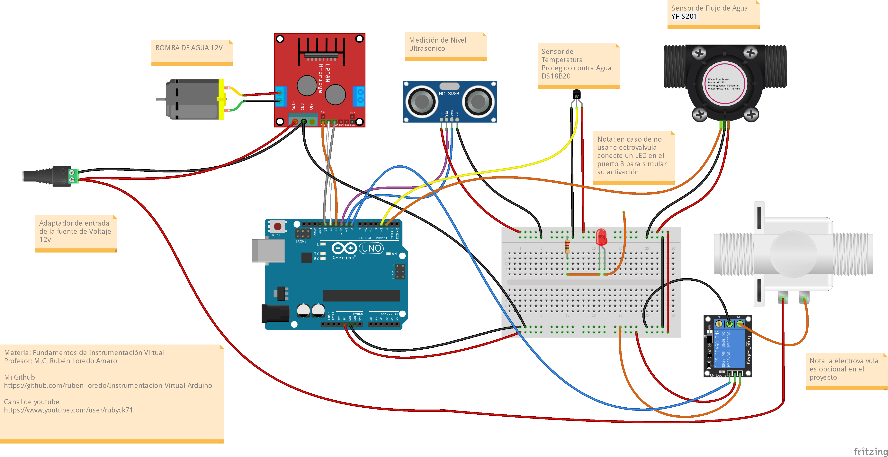

# Instrumentacion Virtual Arduino
 Programas de la materia de Fundamentos de Instrumentación Virtual del Profesor Rubén Loredo, utilizaremos la plataforma de hardware de Arduino y  LabVIEW 2020 para la realización de practicas de aprendizaje en la materia
 

